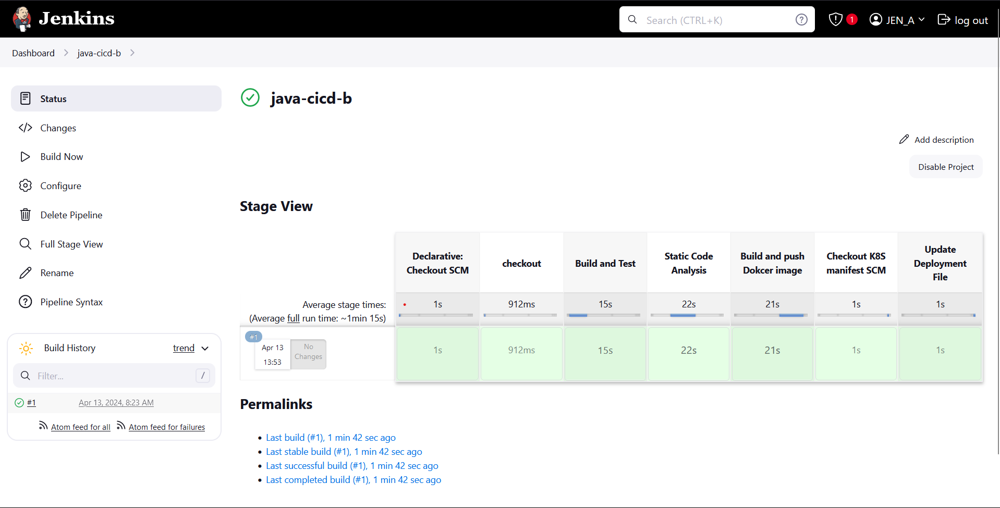
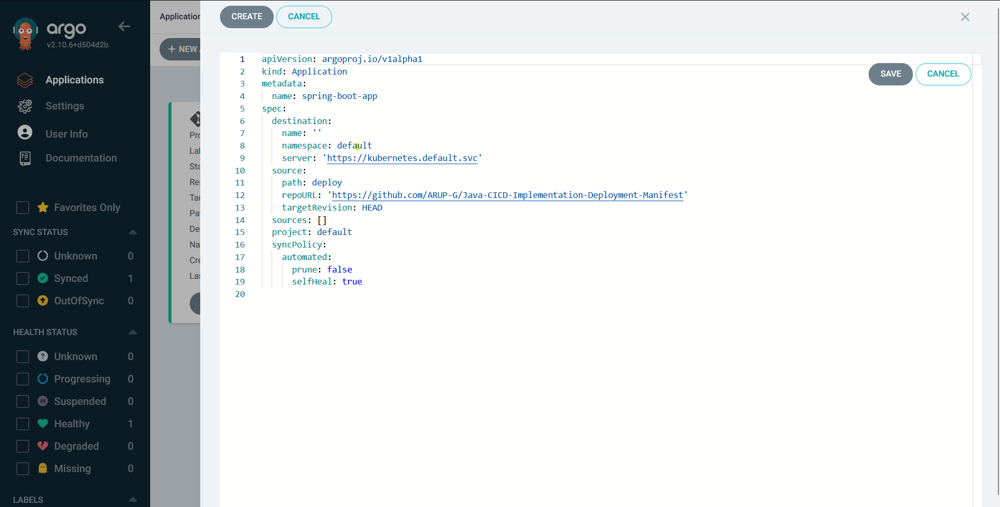
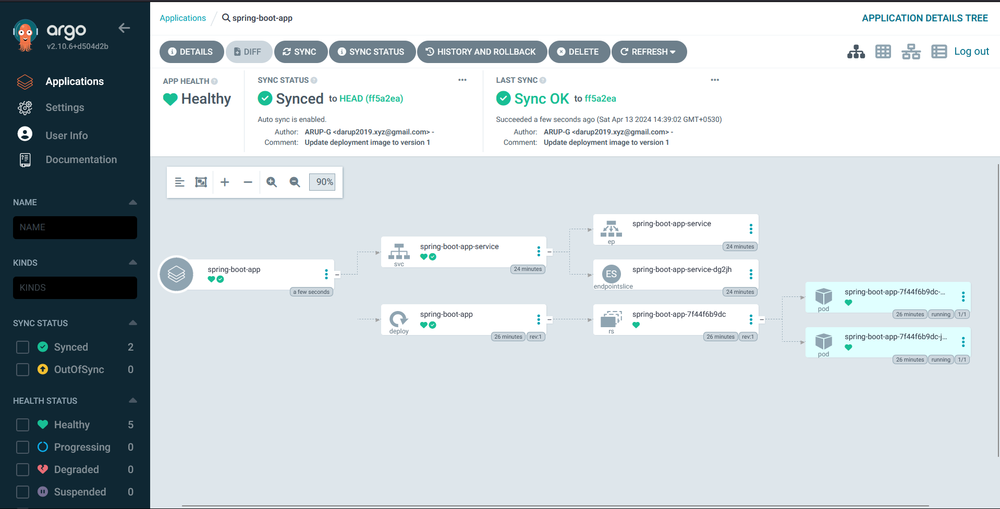
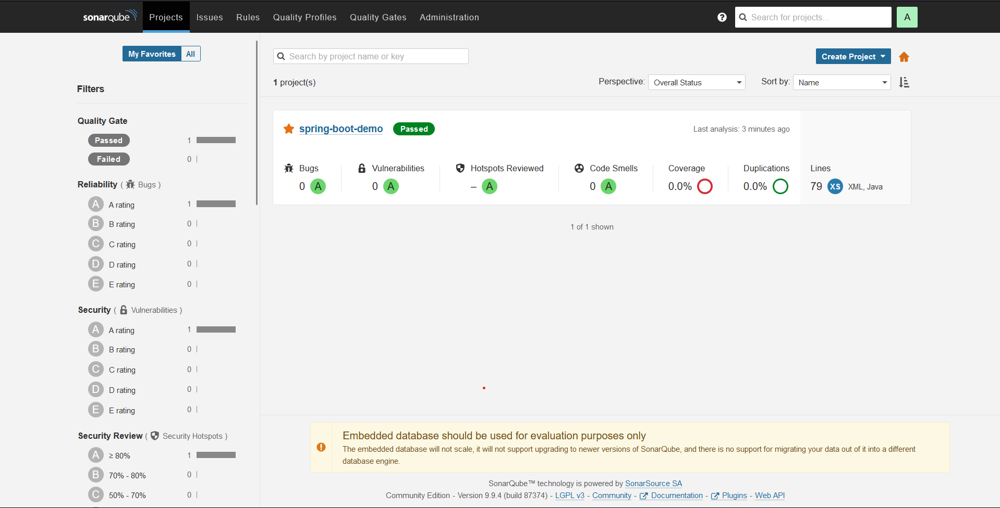

# Java-CICD-Implementation 
## Overview
This project is a SpringBoot application developed to demonstrate a Continuous Integration and Continuous Deployment (CI/CD) pipeline using Docker, Jenkins, ArgoCD, Kubernetes, and SonarQube. The application serves as a template for developers to understand and implement CI/CD practices in their SpringBoot projects.
**The entire setup is deployed on an AWS EC2 instance, showcasing a cloud-based infrastructure for continuous integration and deployment.**

## Features
- SpringBoot application template.
- CI/CD pipeline implemented with Docker, Jenkins, ArgoCD, Kubernetes, and SonarQube.
- Docker containers for building, testing, and deploying the application.
- Jenkins for automating build, test, and deployment processes.
- ArgoCD for continuous delivery and GitOps-based deployment.
- Kubernetes for container orchestration and deployment.
- SonarQube for code quality analysis and static code scanning.
- AWS EC2 instance for hosting the entire setup.

## Prerequisites

- AWS account with EC2 access.
- Basic knowledge of AWS services.
- Docker installed on your EC2 instance.
- Kubernetes cluster configured on PC (e.g., Minikube, Docker Desktop Kubernetes, or any cloud provider).
- Jenkins installed and configured on EC2.
- ArgoCD setup with access to your Kubernetes cluster.
- SonarQube server accessible from your EC2 instance.

## Getting Started
1. **Launch an EC2 instance on AWS with appropriate permissions.**
 - Go to AWS Console
 - Instances
 - Launch instances
 - EC2 > Instances 
 - In the bottom tabs -> Click on Security
 - Security groups
 - Add inbound traffic rules 
 - Allow TCP port:`8080`(for Jenkins) & port:`9000` (for Sonarqube)

 

2. **SSH into your EC2 instance.**
3. **Clone this repository to your EC2 instance.**

```sh
 git clone https://github.com/ARUP-G/Java-CICD-Implementation
```
4. **Navigate to the project directory.**
```sh
cd Java-CICD-Implementation
```
5. **Build the Docker image.**
```sh
dokcer build -t spring-boot-app .
```
6. **Run the Docker container locally for testing.**
```sh
docker run -d -p 8000:8000 spring-boot-app
```
7. **Access the application at** `http://your_ec2_public_ip:8000`.

## AWS EC2 Configuration
- Update existing packages
```sh
sudo apt update
```
- Download Java (JDK) for Jenkins to run
```sh
sudo apt install openjdk-17-jre -y
```
- Download Jenkins
```sh
sudo wget -O /usr/share/keyrings/jenkins-keyring.asc \
  https://pkg.jenkins.io/debian-stable/jenkins.io-2023.key
echo deb [signed-by=/usr/share/keyrings/jenkins-keyring.asc] \
  https://pkg.jenkins.io/debian-stable binary/ | sudo tee \
  /etc/apt/sources.list.d/jenkins.list > /dev/null
sudo apt-get update
sudo apt-get install jenkins
```
- Check if Jenkins Running properly
```sh
ps -ef | grep jennkins
```
- Can Access the jenkins in `http://your_ec2_public_ip:8080`
- For admin password
```sh
 sudo cat /var/lib/jenkins/secrets/initialAdminPassword
```
- **Docker** install for build and pipeline agent
```sh
sudo apt install docker.io
```
- Grant Jenkins user and Ubuntu user permission to docker deamon
```sh
sudo su -
usermod -aG docker jenkins
usermod -aG docker ubuntu
systemctl restart docker
```


## CI/CD Pipeline
**The CI/CD pipeline is implemented with Jenkins and ArgoCD:**

### Jenkins is responsible for:

- Triggering the pipeline on code commits.
- Building the Docker image.
- Scanning code with SonarQube.
- Pushing the Docker image to the Docker registry.
- Update imageTag in deployment manifest repository .
- ArgoCD continuously monitors the Git repository for changes and automatically deploys the application to Kubernetes clusters.
### Jenkins Configuration

- Install necessary plugins: Docker Pipeline, Kubernetes Continuous Deploy, SonarQube Scanner, etc.
- Configure Jenkins credentials for Docker registry `'docker-cred'`, Github `'github'`, and SonarQube server token `'sonarqube'`.
- Create a Jenkins pipeline job and configure the pipeline script from Jenkinsfile with proper path `spring-boot-app/Jenkinsfile`.




### ArgoCD Configuration
- Start Minikube cluster on PC (For Minikube Installation "https://minikube.sigs.k8s.io/docs/start/")
```sh
minikube start
```
- Create namespace

```sh
kubectl create namespace argocd
```

- Install ArgoCD

```sh
kubectl apply -n argocd -f https://raw.githubusercontent.com/argoproj/argo-cd/stable/manifests/install.yaml
```

- To show all the services of Argocd
```sh
 kubectl get services -n argocd
 ```
- To connect to ArgoCD server
```sh
 kubectl edit svc argocd-server -n argocd

 # in the text/yaml file change the type from ClustreIP to NodePort and save

 type: NodePort
```
- Create tunnel to Argocd-server
```sh
 minikube service argocd-server -n argocd
```
- Click any of 2 IP provided by Minikube and open ArgoCD
- Secret to Login & decode it from base64
```sh
 kubectl get secret -n argocd
 kubectl edit secret argocd-initial-admin-secret -n argocd
 ```
 - Create ArgoCD application

 

 - Check Spring-boot-application


### SonarQube Configuration
- Install and configure SonarQube server (Docker image).
```sh
docker run -d -p 9000:9000 sonarqube:lts-community
```
- Access SonarQube server `"http://your_ec2_public_ip:9000"`



- Set up a SonarQube project for your SpringBoot application and modify `Static Code Analysis` stage and update `SONAR_URL`
```sh
 SONAR_URL = "http://your_ec2_public_ip:9000"
 ```
- Obtain SonarQube access token and configure it in Jenkins under credentials.


## Monitoring
- Monitor the CI/CD pipeline execution in Jenkins.
- Monitor application health and performance in ArgoCD dashboard.
- Analyze code quality and vulnerabilities in SonarQube.

## AWS Security
- Ensure proper security configurations on your AWS EC2 instance, including security groups, IAM roles, and network access control.

## License
This project is licensed under the Apache License.

## Contributors
Arup Das

## Acknowledgments
Special thanks to the developers of Docker, Jenkins, ArgoCD, Kubernetes, and SonarQube for their fantastic tools and contributions to the open-source community.


